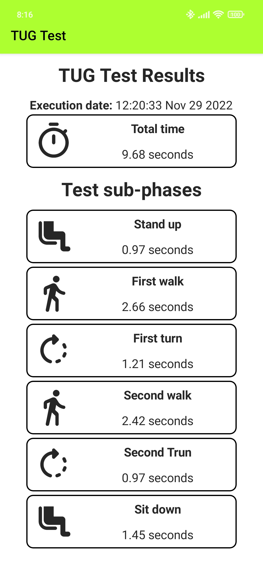

# TUG Test Smartphone

[](https://zenodo.org/badge/latestdoi/449251517)

This NativeScript application aims to automate the obtaining of results from the execution of the TUG test.

The application obtains accelerometer and gyroscope data collected from a companion WearOS application,
[TUG Test Smartwatch](https://github.com/matey97/TugTestSmartwatch), or from the smartphone itself, and after processing the received data uses it in
a machine learning model to estimate the current activity the user is doing. With these estimations, the application
is able to detect the execution of the test (once manually started from the smartwatch application or from the smartphone) and its ending,
computing then the results of the test. The computed results are:

- Total duration of the test.
- Duration of each sub-phase of the test:
  - Stand up.
  - First walk.
  - First turn.
  - Second walk.
  - Second turn.
  - Sit down.

When using the smartphone as the sensing device, the application has two functioning modes (as in [TUG Test Smartwatch](https://github.com/matey97/TugTestSmartwatch)):
- TUG mode: the collected sensor data is used to estimate the current activity of the user while performing the TUG test.
- Collection mode: sensor data is collected and stored in a file.

This application is part of the system developed and described in the [AIME 2022](https://aime22.aimedicine.info) conference paper
*Instrumented Timed Up and Go test using inertial sensors from consumer wearable devices*.

## Requirements

The usage of this application has some hardware and software requirements:

### Hardware requirements
- Android smartphone with Android 6.0 (Marshmallow) or superior.
- Android smartwatch with Wear OS 2.0 or superior (to use smartwatch data).
- Devices must be paired: install the [Smartwatch Wear OS by Google](https://play.google.com/store/apps/details?id=com.google.android.wearable.app&hl=es&gl=US)
  app in the smartphone and go through the pairing process.

### Software requirements
- A [Firebase project](https://firebase.google.com/docs/android/setup#create-firebase-project)
- A machine learning model trained to detect the activities executed during the test: sitting, stand up, walk, turn and sit down.
  The application requires a TensorFlow Lite model with its labels embedded in an external file, which is downloaded from [Firebase Custom ML](https://firebase.google.com/docs/ml/use-custom-models).
  You can find the model used in the paper [here](https://github.com/matey97/TugTestAnalytics/tree/master/MODEL) and upload it to your Firebase project Custom ML.
  - Different models are required depending on the sensing data source (smartphone or smartwatch).
  - MLP (input 1x47, output 1x5) and CNN (input 1x6x50, output 1x5) architectures are supported.
- NativeScript CLI (see [Install and configure NativeScript](#install-and-configure-nativescript))
- If desired, the paired smartwatch must have installed the [TUG Test Smartwatch](https://github.com/matey97/TugTestSmartwatch).

## Environment setup

### Clone repository
Download this repository as a ZIP and extract it or clone it executing:

```
> git clone https://github.com/matey97/TugTestSmartphone.git
```

### Install and configure NativeScript
The application has been developed used NativeScript, so you need to download its tools to build and run the application (if not installed already):
- [Instructions for Windows](https://docs.nativescript.org/environment-setup.html#windows-android).
- [Instructions for Mac](https://docs.nativescript.org/environment-setup.html#macos-android).
- [Instructions for Linux](https://docs.nativescript.org/environment-setup.html#linux-android).

### Configure Firebase
For the application to be able to obtain the ML model from your Firebase project, you have to add the application into your
Firebase project and include the Firebase configuration file into the project:
- [Add Android app to project](https://firebase.google.com/docs/android/setup#register-app).
- After the app is added to your project, you will be able to download the Firebase configuration file, i.e., `google-services.json`.
  Download the file and place it in `App_Resources/Android`.


## Deploy application
- Connect your Android smartphone (with Developer Options > USB Debugging enabled) through USB to your computer
- Open a command line interface in the project folder and run:

```
> ns run android
```

Once the command has finished, the application should be installed in your smartphone.
The application shows a list with the TUG executions done:


You can tap any execution to see its detailed results:



## License

See [LICENSE](./LICENSE).


