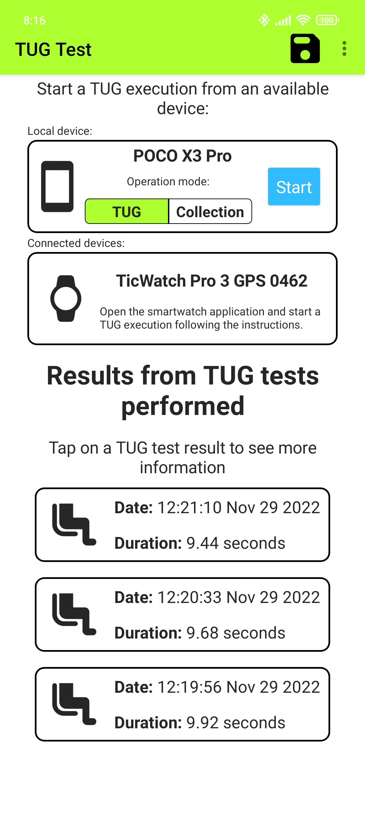

# TUG Test Smartphone

[](https://zenodo.org/badge/latestdoi/449251517)

This NativeScript application aims to automate the obtaining of results from the execution of the TUG test.

The application obtains accelerometer and gyroscope data collected from a companion WearOS application,
[TUG Test Smartwatch](https://github.com/matey97/TugTestSmartwatch), or from the smartphone itself, and after processing the received data uses it in
a machine learning model to estimate the current activity the user is doing. With these estimations, the application
is able to detect the execution of the test (once manually started from the smartwatch application or from the smartphone) and its ending,
computing then the results of the test. The computed results are:

- Total duration of the test.
- Duration of each sub-phase of the test:
  - Stand up.
  - First walk.
  - First turn.
  - Second walk.
  - Second turn.
  - Sit down.

When using the smartphone as the sensing device, the application has two functioning modes (as in [TUG Test Smartwatch](https://github.com/matey97/TugTestSmartwatch)):
- TUG mode: the collected sensor data is used to estimate the current activity of the user while performing the TUG test.
- Collection mode: sensor data is collected and stored in a file.


## Requirements

The usage of this application has some hardware and software requirements:

### Hardware requirements
- Android smartphone with Android 6.0 (Marshmallow) or superior.
- Android smartwatch with Wear OS 2.0 or superior (to use smartwatch data).
  - Devices **must be paired**: install the [Smartwatch Wear OS by Google](https://play.google.com/store/apps/details?id=com.google.android.wearable.app&hl=es&gl=US)
  app in the smartphone and go through the pairing process.

### Software requirements
- NativeScript CLI (see [Install and configure NativeScript](#install-and-configure-nativescript))
- If desired, the paired smartwatch must have installed the [TUG Test Smartwatch](https://github.com/matey97/TugTestSmartwatch).

## Environment setup

### Clone repository
Download this repository as a ZIP and extract it or clone it executing:

```bash
git clone https://github.com/matey97/TugTestSmartphone.git
```

### Install and configure NativeScript
The application has been developed used NativeScript, so you need to download its tools to build and run the application (if not installed already):
- [Instructions for Windows](https://docs.nativescript.org/environment-setup.html#windows-android).
- [Instructions for Mac](https://docs.nativescript.org/environment-setup.html#macos-android).
- [Instructions for Linux](https://docs.nativescript.org/environment-setup.html#linux-android).


## Deploy application
- Connect your Android smartphone (with Developer Options > USB Debugging enabled) through USB to your computer
- Open a command line interface in the project folder and run:

```bash
ns run android
```

Once the command has finished, the application should be installed in your smartphone.

### Collection mode
The application stores accelerometer and gyroscope data into a file. The collected data could then be used for analysis
or to train machine learning models. The data is stored in `json` format, in batches of 50 samples, as following:

```json
[
  {
    "type": "accelerometer",
    "timestamp": {
      "value":1667398706868,
      "offset":-60
    },
    "change": "none",
    "id": "6c841a4b-c3ad-41b4-968c-c671771b176a",
    "samples": [
      {"x": -0.08614161610603333,"y": 0.16749759018421173,"z": 9.92124080657959, "timestamp": 1667398706868 },
      ...
    ] // 50 samples
  },
  {
    "type":"gyroscope",
    "timestamp":{
      "value":1667398707013,
      "offset":-60
    },
    "change":"none",
    "id":"1043b67b-e85b-4877-99a3-f7bc98dec5b5",
    "samples": [
      {"x": -0.0004581354442052543, "y": -0.00030542362947016954, "z": -0.0007635590736754239, "timestamp": 1667398707013},
      ...
    ] // 50 samples
  },
  ...
]
```

The files are stored in the application internal memory, so they are only
accessible through specific tools. It is recommended to use [Android Studio's Device File Explorer](https://developer.android.com/studio/debug/device-file-explorer).


### TUG mode
The collected sensor data is used to estimate current user's activity in the context of the TUG test. After the user finished
the test, the application computes the duration of each activity performed during the test.

#### Activity recognition
The activity estimation is carried out by a machine learning model. The application has 2 embedded machine learning models:
- CNN Smartphone Actions Classifier: convolutional machine learning model for activity recognition for data coming from the smartphone sensors.
- CNN Smartwatch Actions Classifier: convolutional machine learning model for activity recognition for data coming from the paired smartwatch sensors.

All models can be found in [app/ml-models](app/ml-models).

#### Add your models
You can add new TensorFlow Lite models trained with your own data. The models must be capable of detecting the actions
performed during the test, i.e., sit, standing, walking, turning and sitting.

The only restriction is that the models have to include metadata and the **labels for the output layer** as an [associated file](https://www.tensorflow.org/lite/models/convert/metadata#pack_the_associated_files).
Check the requirements in [@awarns/ml-kit](https://github.com/GeoTecINIT/awarns-framework/blob/main/packages/ml-kit/).

> **Note:** it's important that in the associated file, the activity labels must have the following names:
> SIT, STANDING, WALKING, TURNING and SITTING.
>
> The importance of the labels file is to map the i<sub>th</sub> output of the model with the i<sub>th</sub> label.

Once ready, the models new models can be added in [`app/ml-models/`](app/ml-models), using the following naming convention: `<device>_<model_name>-<type>-[version].tflite`, where:
- `<device>` is the sensing device the model is meant to work with. Can be `local` (i.e., smartphone) or `paired` (i.e., smartwatch).
- `<model_name>` is a name to identify the model file.
- `<type>` is the architecture type of the model. Can bel  `cnn` (i.e., Convolutional Neural Network) or `mlp` (i.e., Multilayer Perceptron, ANN).
- `[version]` is an optional version label.
Check the examples in [`app/ml-models/`](app/ml-models).


> **Note:** if you have modified the models' folder, and you have previously compiled the application, run `ns clean` before executing `ns run android` again.

### Screenshots

#### Main view
The application shows a list with the TUG executions done:



#### Detail view
You can tap any execution to see its detailed results:


## License

Apache License 2.0. See [LICENSE](./LICENSE).


